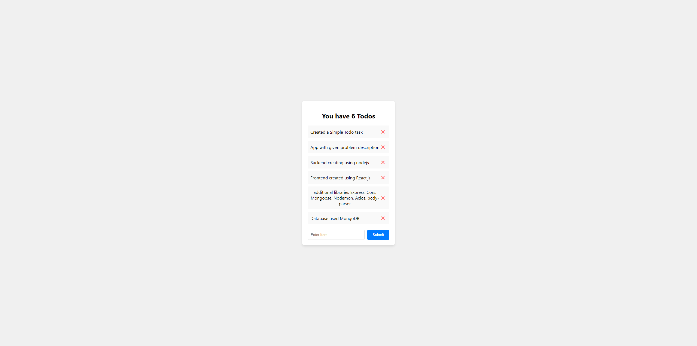

---

# MERN Stack To-Do Application

A simple To-Do application built using the MERN stack (MongoDB, Express.js, React.js, and Node.js). This application allows users to add, delete, and display a list of to-dos. The application has a clean and user-friendly interface and connects to a MongoDB database to store and retrieve to-dos.

## Features

- **Add To-do**: Users can add new to-dos using an input field.
- **Delete To-do**: Users can delete to-dos using a delete button next to each to-do.
- **Display To-dos**: The application displays the list of to-dos fetched from the MongoDB database.
- **To-do Count**: The application displays the total count of to-dos.

## Project Structure

```
backend/
│
├── models/
│   └── todo.js
│
├── controllers/
│   └── todoController.js
│
├── routes/
│   └── todoRoutes.js
│
├── .env
├── index.js
├── package.json
└── package-lock.json
```

## Setup Instructions

### Prerequisites

- Node.js
- npm (Node Package Manager)
- MongoDB (local installation or MongoDB Atlas for a cloud-based database)

### Backend Setup

1. **Clone the Repository**

   ```sh
   git clone https://github.com/NirmalKAhirwar/todo_app.git
   cd todo_app/backend
   ```

2. **Install Dependencies**

   ```sh
   npm install
   ```

3. **Set Up Environment Variables**

   Create a `.env` file in the root directory of `todo-backend` and add your environment variables:

   ```env
   MONGODB_URI=your_mongodb_connection_string
   PORT=5000
   ```

4. **Run the Server**

   ```sh
   node index.js
   ```

### Frontend Setup

1. **Navigate to Frontend Directory**

   ```sh
   cd ../frontend
   ```

2. **Install Dependencies**

   ```sh
   npm install
   ```

3. **Run the Frontend**

   ```sh
   npm start
   ```

## Usage

- Open your browser and navigate to `http://localhost:3000` to access the application.
- Add new to-dos using the input field and submit button.
- Delete to-dos using the delete button next to each to-do item.
- View the list of to-dos and the total count of to-dos.

## API Endpoints

- `GET /api/todos`: Fetch all to-dos.
- `POST /api/todos`: Add a new to-do.
- `DELETE /api/todos/:id`: Delete a to-do by ID.

## File Descriptions

- **index.js**: The main server file that sets up the Express server and connects to MongoDB.
- **models/todo.js**: Defines the Mongoose schema and model for to-dos.
- **controllers/todoController.js**: Contains the controller functions for handling API requests.
- **routes/todoRoutes.js**: Defines the API routes and connects them to the controller functions.
- **.env**: Environment variables (not included in the repository).

## Screenshots



## License

This project is licensed under the MIT License - see the [LICENSE](LICENSE) file for details.

---
